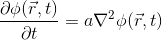
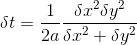

# parallel-finite_difference-diffusion-equation-solver
Parallel (MPI) Row decomposed Diffusion Equation solver by explicit Finite Difference method

Diffusion Eqution:    

To compile: mpicc diff_expl_fd.c -o diffusion -lm

To run: mpiexec -n [processors to deploy] ./diffusion [grid points along rows] [grid points along columns]

Criteria for stability and convergence of Explicit method:    

